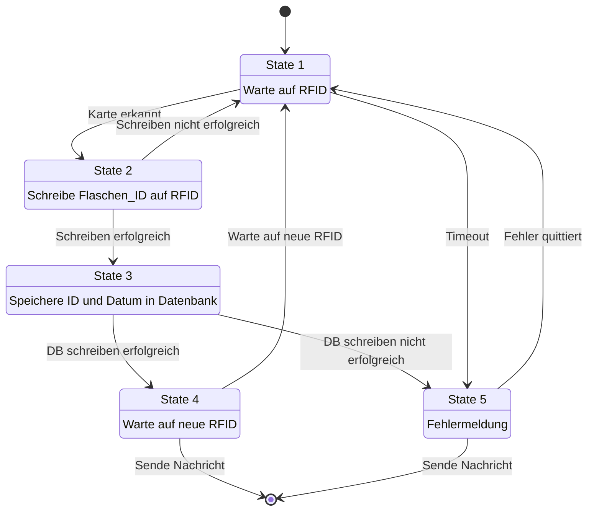
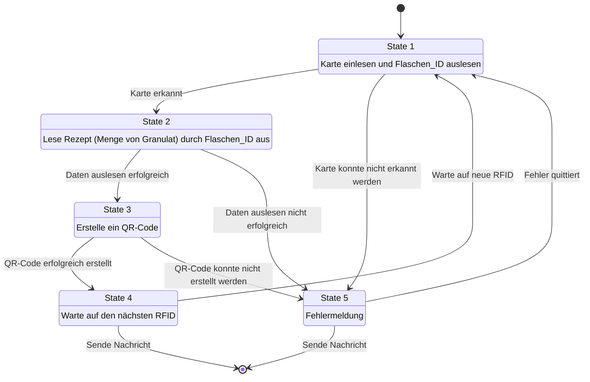

# IOT2 - Raspberry Pie

## Teaching Factory mit AutoID (RFID-Chip)

### Station 1: Flaschen ID schreiben

- Flasche mit `Flaschen_ID` beschreiben (RFID-Tag) bevor die Flasche in die Abfüllstation kommt
- Wählen Sie hierzu das erste Byte im zweiten Block aus, um die `Flaschen_ID` zu speichern
- Hierbei soll die erste Flasche in der Datenbank Tabelle `Flasche` gewählt werden, welche noch einne `0` in `Tagged_Date` hat
- Nach dem Schreiben der ID soll die Flaschen-ID in der Datenbank getagged werden (indem `Tagged_Date` mit dem aktuellen Unix-Time-Stamp befüllt wird.)

### UML-Diagramm von Station 1

---

### Station 2: Abfüllen

- Die Station dient dazu die Rezepte zu einer Flasche abrufen bevor die Flasche an einem Dispenser ankommt
- Die Flaschen und Rezepte für die Flaschen liegen in der bereitgestellten Datenbank unter der Tabelle `Rezept_besteht_aus_Granulat`
- Geben Sie die `Flaschen_ID` und die Menge der relevanten Granulate als Sinnvolle Meldung in der Kommandozeile aus

### UML-Diagramm von Station 2

#### Abgabe

- Geben Sie einen Link zu einem Öffentlichen **Git-Repository** ab, in dem Sie die beiden Stationen implementiert haben
- 5pt: Station 1: Schreiben Sie ein Python-Modul `station1.py`, das den RFID-Tag der Flaschen-ID mit der ersten noch nicht vergebenen Flaschen-ID beschreibt. Geben Sie ein Log-File `station1.log` ab, das das Starten der Station und das Schreiben der Flaschen-ID dokumentiert (im erfolgreichen und nicht erfolgreichen Fall)
- 5pt: Station 2: Schreiben Sie ein Python-Modul `station2.py`, das anhand der RFID-Tags der Flaschen-ID die richtige Menge ermittelt. Geben Sie ein Log-File `station2.log` ab, das for Füllmengen für zwei verschiedene Flaschen dokumentiert
- 2pt: Zeichnen Sie ein Zustandsübergangsdiagramm für beide Stationen, für ein funktionierendes Fehlermanagement und fügen Sie dieses in die `README.md` des Repositories ein
- 2pt: Bauen sie die beiden Module in je ein eine sinnvolle State-Machine für ein Fehlermanagement ein, damit z.B. wenn der RFID Tag zu früh entfernt wird

---

**Hinweis**: - Es ist einfacher erst kleine Test-Programme zu Interaktion mit der Datenbank und den RFID-Reader zu schreiben, bevor Sie die Module in die State-Machine einbauen - Warten Sie hiervor ggf. die Vorlesung in Software Engineering ab

---

#### Abgabe Bonus (2pt)

- 2pt: Für alle korrekt abgefüllten Flaschen wird ein QR-Code erstellt, welche die ID und den Rezept-Nummer und das Datum enthält

### QR-Codes

