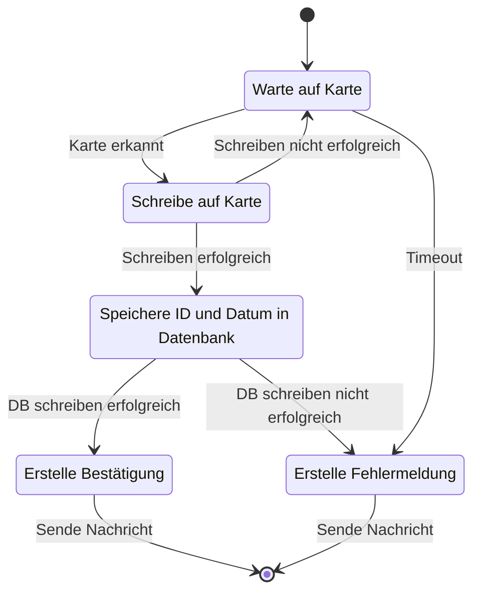

# IOT2 - Raspberry Pie
## Teaching Factory mit AutoID (RFID-Chip)
### Station 1: Flaschen ID schreiben

-   Flasche mit `Flaschen_ID` beschreiben (RFID-Tag) bevor die Flasche in die Abfüllstation kommt
-   Wählen Sie hierzu das erste Byte im zweiten Block aus, um die `Flaschen_ID` zu speichern
-   Hierbei soll die erste Flasche in der Datenbank Tabelle `Flasche` gewählt werden, welche noch einne `0` in `Tagged_Date` hat
-   Nach dem Schreiben der ID soll die Flaschen-ID in der Datenbank getagged werden (indem `Tagged_Date` mit dem aktuellen Unix-Time-Stamp befüllt wird.)

### UML-Diagramm von Station 1

